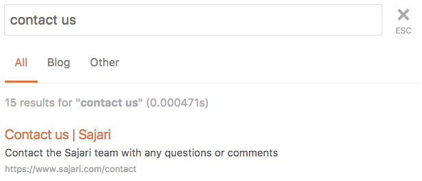
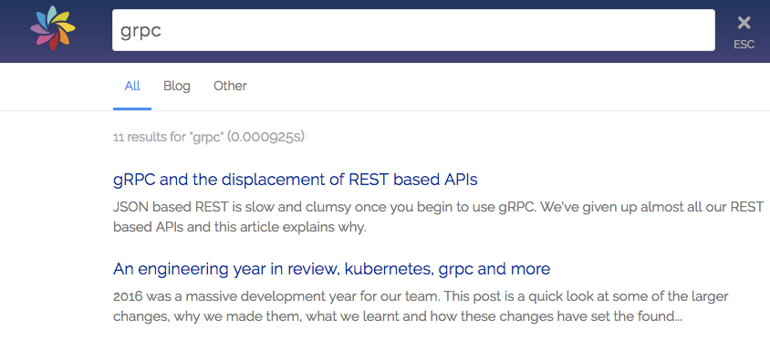
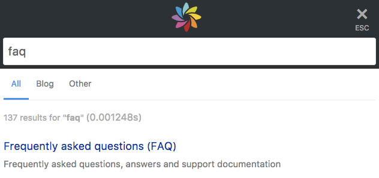

# Sajari Website Search Integration

Our auto-generated search integrations are a quick and easy way to get [Sajari Website Search](https://www.sajari.com/website-search) running on your site.

This repository is used in the [Console](https://www.sajari.com/console/collections/install) to generate search interfaces which can be copy-pasted directly into your website.

This website search integration is built using the [Sajari React SDK](https://www.github.com/sajari/sajari-sdk-react).

## Instructions

This integration requires a website collection. You can [Sign Up](https://www.sajari.com/console/sign-up) and create a website collection to get started.

From the [Install tab](https://www.sajari.com/console/collections/install) in the Console you can generate a search interface which can be copy-pasted into your site.  It's easy to add further customisations using CSS (see [Styling](#styling)), or by changing the JSON config (see [Configuration](#configuration)).


## Styling

The generated interface is designed to be responsive by default, and can be easily styled to fit your website's look and feel.

Here are a few CSS examples showing how to override the default layout.

### Brand colors

* Override the link/tab colours and font.

Source: [orange.css](./sample-styles/orange.css)



### Brand image and colors, hiding elements

* Override the link/tab colours and font.
* Set a brand image.
* Hide URL links in results.

Source: [light.css](./sample-styles/light.css)



### Responsive layout with brand image.

* Override the link/tab colours and font.
* Set a brand image.
* Custom responsive layout for small screens.

Source: [sajari.css](./sample-styles/sajari.css)




## Integrations

There are 4 types of integration:

* [*inline*](#inline): search box, results.  Interface is embedded directly into a page (or pages) on your website, for instance a dedicated search page with a search box + results.

* [*overlay*](#overlay): full page overlay, search box, results.  Interface appears as an overlay on top of the current page.  Can be used to search without leaving the page.

* [*search box*](#search-box): search box.  Typical usage includes being embedded into headers and menus.

* [*dynamic content*](#dynamic-content): results. Typically used to put pre-baked searches into pages, to show similar or popular content, or article listings by tag/category etc for landing pages.

It's possible to use [multiple integrations](#multiple-integrations) on the same site/page. For instance: have a search box in the header of your site, which then redirects to an inline search results page when triggered.

**NOTE: The code examples in this README assume integrations have been generated from the [Console](https://www.sajari.com/console/collections/install). Generated interfaces come with a handful of [helper functions](#helper-functions) which are referenced in the following examples.**

### Inline

The inline search integration renders a full search interface (input box and results) inside a webpage. A typical example would be a dedicated search results page which is linked to/navigated to by search forms on a website. In the configuration example given below, the search query can be passed to the page using the query param q.


```javascript
myUI("create-inline", {
  project: "<your project>", // Set this to your project.
  collection: "<your collection>", // Set this to your collection.
  values: { resultsPerPage: "10", "q": getUrlParam("q") }, // Default pipeline values
  attachSearchBox: document.getElementById("search-box"), // DOM element to render search box.
  attachSearchResponse: document.getElementById("search-response"), // DOM element to render search results.
  results: { showImages: false }, // Results configuration
  pipeline: "website", // Set this to your search pipeline
  instantPipeline: "autocomplete", // Set this to your instant pipeline
  inputPlaceholder: "Search", // Placeholder text for the input element
  maxSuggestions: 5, // Maximum number of suggestions in the search box
  tabFilters: {}, // Tab configuration
});
```

### Overlay

The overlay search integration renders a search interface on top of existing pages. Typically this is used on sites that prefer not to navigate users away from their current page to see results.


```javascript
myUI("create-overlay", {
  project: "<your project>",
  collection: "<your collection>",
  values: { resultsPerPage: "10", "q": getUrlParam("q") },
  results: { showImages: false },
  pipeline: "website",
  instantPipeline: "autocomplete",
  inputPlaceholder: "Search",
  autocompleteMaxSuggestions: 5,
  inputAutoFocus: true,
  tabFilters: {},
});
```

### Search Box

The Search Box integration creates an autocomplete-enabled input box typically embedded into site headers and menu bars. It performs autocomplete lookups for each user keypress and can be customised to redirect to a search results page or trigger custom search actions.


```javascript
myUI("create-search-box", {
  project: "<your project>",
  collection: "<your collection>",
  instantPipeline: "autocomplete",
  inputPlaceholder: "Search",
  maxSuggestions: 5,
  attachSearchBox: document.getElementById("search-box")
});
```

### Dynamic Content

The Dynamic Content integration creates a results block using search results from a pipeline. It can typically be used to show similar or popular pages.


```javascript
myUI("create-dynamic-content", {
  project: "<your project>",
  collection: "<your collection>",
  pipeline: "website",
  attachDynamicContent: document.getElementById("dynamic-content"),
  values: { "resultsPerPage": "3" },
  results: { "showImages": false },
  tracking: false,
  searchOnLoad: true,
});
```

### Helper Functions

The generated interface code comes with two helper functions:

- `getUrlParam(x)` extracts a value from a url parameter `x`.
- `setup` creates an object that controls an instance of the integration.

### Multiple Integrations

Every integration is bound to its own variable (using the `setup` function), so it's easy to have multiple integrations running on the same page.  You an also have them interact with each other by subscribing and publishing events between them.

```javascript
myUI = setup(...);
secondUI = setup(...);

myUI("create-search-box", ...);
secondUI("create-inline", ...);
```

## Configuration

The generated search interfaces are configured using a JSON object. Generating an interface from the console will prefill the configuration for you, setting default values where necessary.

**General configuration**

| Property | Default | Description |
| :-- | :-: | :-- |
| project | `"<your project>"` | Project to search |
| collection | `"<your collection>"` | Collection to search |
| pipeline | `"website"` | Pipeline to query when pressing enter or clicking a suggestion |
| instantPipeline | `"autocomplete"` | Pipeline to query when typing |
| maxSuggestions | `"5"` | Sets how many autocomplete suggestions are shown in the box below the search input |
| inputPlaceholder | `"Search"` | Placeholder text in the search input box |
| inputAutoFocus | `false` | Focus the searc input html element on initialisation |
| values | *see table below* | Configuration of the pipeline values |
| results | *see table below* | Configuration for the search results |

**Values configuration**

| Property | Default | Description |
| :-- | :-: | :-- |
| q | `getUrlParam("q")` | The initial value of `q` in the pipeline, commonly used as the query text |
| resultsPerPage | `"10"` | Number of results to show per page |

**Results configuration**

| Property | Default | Description |
| :-- | :-: | :-- |
| showImages | `false` | Show images next to search results |

### Events

Interfaces are created using `setup` which is included when generating the interface from the console.

```javascript
myUI = setup(window, document, "script", "sajari");
```

You can subscribe to events by calling your interface with the `"sub"` value followed by the pipeline (either `pipeline` or `instantPipeline`) and event name, then a callback. It takes the form

```javascript
myUI("sub", "<pipeline>.<event>", callback);
```

For example, if you are using the default inline interface and want to listen to the `search-sent` event, you'd write:

```javascript
myUI("sub", "pipeline.search-sent", function(event, values) {
  console.log("Search sent with values: ", values);
});
```

| Event | Data | Description |
| :-- | :-: | :-- |
| `"search-sent"` | value dictionary | Search request has been sent |
| `"values-updated"` | value dictionary | Value map has updated |
| `"response-updated"` | response object | Response has updated |
| `"page-closed"` | query string | Page is about to be closed |
| `"query-reset"` | query string | Body has changed enough to be considered a new query |
| `"result-clicked"` | query string | Result has been clicked |
| `"search-event"` | query string | Search event |
| `"overlay-show"` | none | Overlay is shown |
| `"overlay-hide"` | none | Overlay is hidden |

You can also publish events which the search interface will pick up.

| Event | Data | Description |
| :-- | :-: | :-- |
| `"values-set"` | value dictionary | Values to merge in |
| `"search-send"` | none | Perform a search |
| `"overlay-show"` | none | Show the overlay |
| `"overlay-hide"` | none | Hide the overlay |

#### Search Sent

A search has sent and we are now waiting for results. The values used in the search are given to the subscribed function.

```javascript
myUI("sub", "<pipeline>.search-sent", function(eventName, values) {
  console.log("Search sent with ", values);
});
```

#### Values Updated

Values in the interface have been updated. A function is given as the 3rd argument that can be used to merge new values into the value dictionary, it behaves like `pub("values-set", {})` except that it doesn't trigger an event.

```javascript
myUI("sub", "<pipeline>.values-updated", function(eventName, values, set) {
  console.log("New values are", values);
});
```

#### Response Updated

The search response has been updated. Caused by a network response being received or results being cleared (usually because the input box has become empty).

You can see more info about the `response` object [here](https://github.com/sajari/sajari-sdk-react#listening-for-responses).

```javascript
myUI("sub", "<pipeline>.response-updated", function(eventName, response) {
  if (response.isEmpty()) {
    return;
  }
  if (response.isError()) {
    console.log("Got error", response.getError());
  } else {
    console.log("Got results", response.getResults());
  }
});
```

#### Search Event

A search event signals the end of a search session. A common use case of subscribing to them is for reporting.

```javascript
myUI("sub", "<pipeline>.search-event", function (eventName, query) {
  console.log("Search session finished, last query", query);
});
```

If you'd like more granular events you can also subscribe to these events.

```javascript
function searchFinished(eventName, query) {
  console.log("Search session finished, last query", query);
}
myUI("sub", "<pipeline>.page-closed", searchFinished);
myUI("sub", "<pipeline>.query-reset", searchFinished);
myUI("sub", "<pipeline>.result-clicked", searchFinished);
```

#### Overlay Show/Hide

Opening and closing the overlay can be done by publishing either the show or hide event.

**Note: The show and hide events do not have a pipeline prefixing the event name!**

```javascript
myUI("pub", "overlay-show");
myUI("pub", "overlay-hide");
```

You can also subscribe to these events

```javascript
myUI("sub", "overlay-show", function(eventName) {
  console.log("The overlay has been shown");
});
myUI("sub", "overlay-hide", function(eventName) {
  console.log("The overlay has been hidden");
});
```

#### Set Values

Merge new values into the values dictionary. Setting a value to undefined will remove it from the values dictionary.

```javascript
myUI("pub", "<pipeline>.values-set", { q: "<search query>" });
```

#### Search

Search will perform a search request using the values in the value map.

```javascript
myUI("pub", "<pipeline>.search-send");
```

### Tab filters

Create tabs to filter search results.  Tabs are rendered in a UI component when search results are shown.  If a tab is clicked then the algorithm parameter `filter` is set to the tab's `filter` attribute.

```javascript
tabFilters: {
   defaultTab: "All", // The title of the default tab.
   tabs: [
      {title: "All", filter: ""},
      {title: "Blog", filter: "dir1='blog'"}, // First directory in URL is 'blog'.
      {title: "Not Blog", filter: "dir1!='blog'"} // First directory in URL is not 'blog'.
   ],
}
```

For more information on building filter expressions, see [filters](#filters).

## Filters

Filters are used to limit the pages that are returned in a search.

Our crawler extracts common fields when it parses web pages (such as the first and second directories of URLs), which make filtering much easier.  It's well worth taking a look at all the extracted fields before you start building filters, as most use cases are quick and easy to get running.

Here is a list of the most commonly used fields.

* `title` The page title.
* `description` The page description.
* `image` The URL of an image which corresponds to the page.
* `lang` The language of the page, extracted from the `<html>` element (if present).

Fields that are based on the URL of the page (ideal for filtering on subsections of a site) are given below.  Examples here assume that the page URL is `https://www.sajari.com/blog/year-in-review`:

* `url` The full page URL: `https://www.sajari.com/blog/year-in-review`
* `dir1` The first directory of the page URL: `blog`
* `dir2` The second directory of the page URL: `year-in-review`
* `domain` The domain of the page URL: `www.sajari.com`


### Using Operators

When querying a field, there are a few operators that can be used. Note, all values must be enclosed in single quotation marks, i.e. "field *boost* must be greater than 10" is written as `boost>'10'`.

| Operator | Description | Example |
| --- | --- | --- |
| Equal To (`=`) | Field is equal to a value (*numeric* or *string*) | `dir1='blog'` |
| Not Equal To (`!=`) | Field is not equal to a value (*numeric* or *string*) | `dir1!='blog'` |
| Greater Than (`>`) | Field is greater than a *numeric* value | `boost>'10'` |
| Greater Than Or Equal To (`>=`) | Field is greater than or equal to a *numeric* value | `boost>='10'` |
| Less Than (`<`) | Field is less than a given *numeric* value | `boost<'50'` |
| Less Than Or Equal To (`<=`) | Field is less than or equal to a given *numeric* value | `boost<'50'` |
| Begins With (`^`) | Field begins with a *string* | `dir1^'bl'` |
| Ends With (`$`) | Field ends with a *string* | `dir1$'og'` |
| Contains (`~`) | Field contains a *string* | `dir1~'blog'` |
| Does Not Contain (`!~`) | Field does not contain a *string* | `dir1!~'blog'` |

### Combining expressions

It's also possible to build more complex filters by combining field filter expressions with `AND`/`OR` operators, and brackets.

| Operator | Description | Example |
| --- | --- | --- |
| `AND` | Both expressions must match | `dir1='blog' AND domain='www.sajari.com'` |
| `OR` | One expression must match | `dir1='blog' OR domain='blog.sajari.com'` |

For example, to match pages with language set to `en` on `www.sajari.com` or any page within the `en.sajari.com` domain:

    (domain='www.sajari.com' AND lang='en') OR domain='en.sajari.com'

